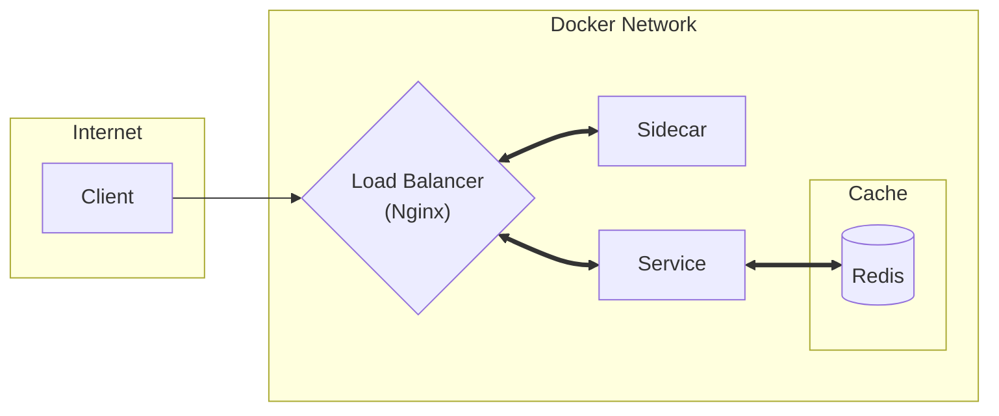

# **gloss-adder-backend**

## **Overview of the Architecture**

```mermaid 
flowchart LR
subgraph Internet
    D[Client]
end

subgraph DOCKER [Docker Network]

  D --> N{"Load Balancer <br/> (Nginx)"}

  N <==> B[Sidecar]
  N <==> C[Service]

  C <==> R

  subgraph Cache
    style Cache margin-top: 100
        R[(Redis)]
  end
end

```

