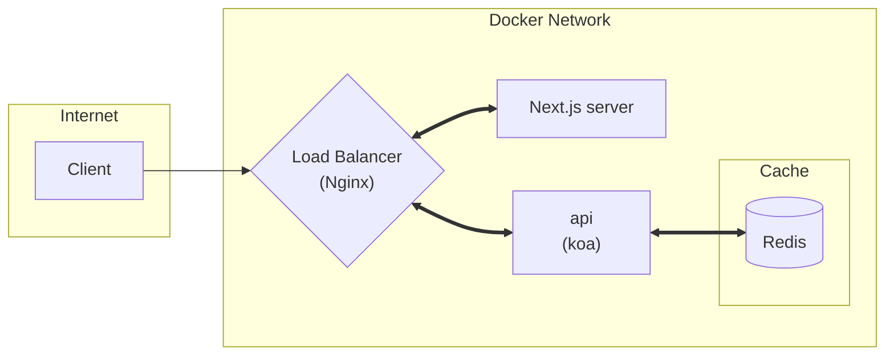

# **gloss-adder-backend**

## **Overview of the Architecture**


## **Setup**
### 1. Download the both frontend and backend projects: 

```bash
git clone git@github.com:Retr0327/gloss-adder-frontend.git
git clone git@github.com:Retr0327/gloss-adder-backend.git
```
Hence, the project strucutre should look like this: 

```
gloss-adder-frontend\        
 |-- public\              # Some static files
 |-- src\                 # Source files
 |-- ...
gloss-adder-backend\
 |-- deployment\          # Deployment folder
 |-- src\                 # Source files
 |-- test\                # Automated tests
 |-- ...
```

### 2. Use docker to run:
Install docker, and use the following command to run:

> Remember to run the command in the backend folder!
 
```bash
docker compose up 
```


